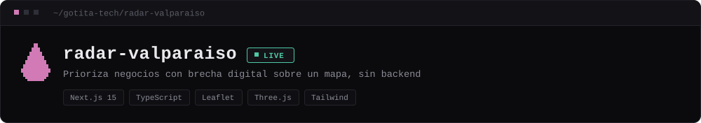
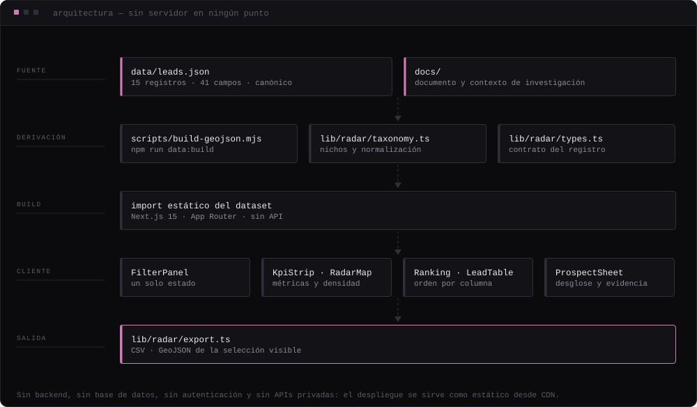

## 01 — OVERVIEW

Dashboard geoespacial que detecta, puntúa y ordena negocios con presencia digital débil en la Región de Valparaíso. 15 fichas verificadas a mano, 41 campos cada una, scoring de 5 dimensiones y evidencia enlazada a su fuente. Todo se resuelve en el navegador.

`Next.js 15` `TypeScript` `Leaflet` `Three.js` `Tailwind`

**[Ver en vivo ↗](https://experimento-02.vercel.app)** · [el radar ↗](https://experimento-02.vercel.app/radar)

## 02 — EL PROBLEMA

Decidir a qué negocio ofrecer un servicio digital suele ser una lista de contactos y una corazonada: no hay forma de comparar dos prospectos ni de justificar por qué uno va antes que otro.

Y cuando existe un ranking, casi nunca se puede rastrear de dónde salió cada número.

## 03 — LA SOLUCIÓN

Cada negocio se evalúa en cinco dimensiones independientes —necesidad digital, atractivo comercial, contactabilidad, encaje con una landing y oportunidad local— que se combinan en un **priority score** acompañado de un **confidence score** y un nivel (`priority_tier`).

La ficha de cada prospecto muestra el desglose completo, las notas de evidencia y los enlaces a las fuentes de las que salió cada dato. El ranking se puede discutir porque se puede auditar.

| Qué | Detalle |
| --- | --- |
| **KPIs** | total de negocios, prospectos HIGH y VERY HIGH, negocios sin sitio web, priority y confidence medios |
| **Mapa** | Leaflet + OpenStreetMap sin token ni variables de entorno, clustering propio, capa de densidad ponderada por priority score y dos bases cartográficas |
| **Ranking y tabla** | Top Opportunities y listado con ordenación por columna — tabla en escritorio, tarjetas en móvil |
| **Ficha de prospecto** | desglose de las cinco dimensiones, evidencia trazable, diagnóstico digital y enlaces reales a web, redes, teléfono y correo |
| **Export** | CSV y GeoJSON de lo que está filtrado en pantalla |

**Cobertura actual del dataset**

| Dato | Valor |
| --- | --- |
| Registros | 15 |
| Campos por registro | 41 |
| Comunas | Valparaíso · Viña del Mar · Concón · Villa Alemana |
| Nichos | `barbershop` · `restaurant` · `bar` · `boutique` |

<sub>Es una muestra recogida y verificada a mano, no un censo. El número importa menos que el hecho de que cada registro se puede rastrear hasta su fuente.</sub>

### La landing que lo envuelve

La ruta `/` es una landing de una sola página construida con la misma regla que el radar: nada se sirve como archivo si se puede generar. Los patrones de fondo son CSS, las partículas son Three.js / React Three Fiber cargado sólo en el navegador, y el sonido de los botones se sintetiza en tiempo real con la Web Audio API — no hay ningún `.mp3` en el repo.

## 04 — DEMO

| Entorno | URL |
| --- | --- |
| Producción | <https://experimento-02.vercel.app> |
| El radar | <https://experimento-02.vercel.app/radar> |

**Rutas**

| Ruta | Contenido |
| --- | --- |
| `/` | Landing de una página |
| `/radar` | Opportunity Radar — el dashboard |

## 05 — CÓMO FUNCIONA

- **Un dataset, versionado.** `data/leads.json` es la fuente de verdad: 15 negocios, 41 campos por registro, con `source_urls`, `evidence_notes` y `data_flags` en cada uno.
- **Derivación reproducible.** `npm run data:build` ejecuta `scripts/build-geojson.mjs` y genera el `.geojson` a partir del JSON canónico. El GeoJSON nunca se edita a mano.
- **Cálculo en el cliente.** El JSON se importa en tiempo de compilación; filtros, métricas y ordenación se resuelven en el navegador sobre datos locales.
- **Un solo estado, cinco vistas.** Comuna, nicho, umbral de priority score, estado web, contactabilidad y búsqueda libre afectan a la vez a KPIs, mapa, capa de densidad, ranking y tabla.
- **Salida abierta.** La selección visible se exporta a CSV o GeoJSON, así que el análisis puede continuar fuera de la aplicación.

## 06 — STACK

`Next.js 15` `TypeScript` `Leaflet` `Three.js` `Tailwind`

```bash
npm install
npm run dev
```

| Comando | Qué hace |
| --- | --- |
| `npm run dev` | Servidor de desarrollo |
| `npm run build` | Build de producción |
| `npm run lint` | ESLint |
| `npm run data:build` | Regenera el GeoJSON desde data/leads.json |

**Variables de entorno**

| Variable | Necesaria | Para qué |
| --- | --- | --- |
| `NEXT_PUBLIC_SITE_URL` | Opcional | Dominio propio para URL canónicas, sitemap y Open Graph. Sin ella se usa el dominio de Vercel |

## 07 — ARQUITECTURA



Sin backend, sin base de datos, sin autenticación y sin APIs privadas: el despliegue se sirve como estático desde CDN.

### Procedencia de los datos

`data/leads.json` es la fuente de verdad y `data/leads.geojson` se deriva de él — nunca al revés. Cada registro lleva `source_urls`, `evidence_notes` y `data_flags`, de modo que cualquier puntuación se puede rastrear hasta el dato que la produjo.

Las reglas completas de normalización están en [`data/README.md`](data/README.md).

Tras editar el dataset:

```bash
npm run data:build
```

## 08 — ESTADO ACTUAL

- Desplegado y accesible. Las dos rutas (`/` y `/radar`) funcionan en producción.
- El dataset son 15 negocios de 4 comunas y 4 nichos, recogidos y verificados a mano. Es una muestra de trabajo, no un censo regional.
- La homepage del repositorio y los topics quedaron sin configurar hasta ahora.

## 09 — SIGUIENTE ITERACIÓN

- Ampliar la cobertura a más comunas y nichos manteniendo la regla de evidencia por registro.
- Automatizar la recogida sin perder la trazabilidad: hoy cada `source_url` se comprueba a mano.
- Separar la landing personal del radar si el dataset crece lo suficiente como para justificar su propio despliegue.


<sub>Parte de **[GOTITA//TECH](https://github.com/gotita-tech/gotita-tech)**. Este README se genera desde el manifiesto del perfil; para cambiarlo, edita `projects.json` allí y vuelve a ejecutar `kit/build.mjs`.</sub>
