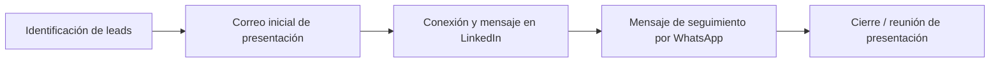
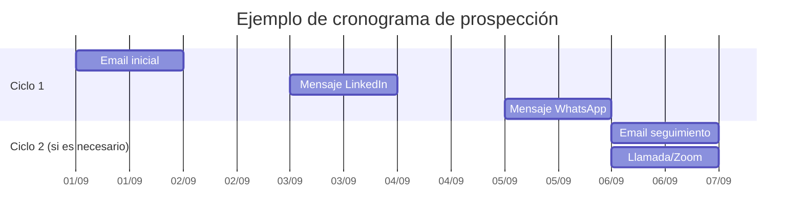

# Resumen Ejecutivo

El segmento objetivo son **PYMES minoristas emergentes** (microempresas y tiendas locales) de diversos sectores (moda, hogar, tecnología, salud, etc.), donde la mayoría aún carece de presencia digital y representa una oportunidad de crecimiento. Según datos recientes, cerca del 95% de las empresas españolas son micro o pequeñas PYMES, y en el comercio minorista hay más de 750.000 establecimientos en España. Muchos de estos negocios no tienen web propia: el 68,2% de empresas con <10 empleados no dispone de web corporativa. Este vacío digital es un criterio de oportunidad clave: negocios con tráfico físico o redes sociales fuertes, catálogos físicos o presencia en marketplaces pero sin sitio propio tienen *urgencia* de “digitalizarse”. Para identificarlos, se usarán fuentes oficiales (Cámaras de Comercio, registros oficiales), directorios online (Google Business, Páginas Amarillas, Yelp, etc. ), marketplaces (Amazon, MercadoLibre, Etsy, etc.) y redes sociales (Facebook, Instagram) como directorios informales. 

Se priorizarán **30 leads** concretos (ejemplos: concept stores de moda, tiendas de barrio, emprendimientos locales), cuyas fichas destacan la falta de web/app, su potencial de ventas y nivel de urgencia. Para cada caso se diseñará un mensaje de prospección personalizado (por email, LinkedIn y WhatsApp). Se propone una secuencia de alcance («correo inicial → conexión/seguimiento en LinkedIn → mensaje por WhatsApp») que siga un cronograma claro (ver diagrama más abajo). Los paquetes típicos se estiman en ~1.500–4.000 € por una landing básica, ~3.000–6.000 € por una tienda online sencilla y ~3.000–8.000 € por una app móvil MVP, con plazos de 1–2 semanas, 3–6 semanas y 6–10 semanas, respectivamente. Se anticipan objeciones comunes (falta de presupuesto, “ya vendemos en redes”, “no lo necesitamos”) y sus respuestas. Finalmente, se recomienda medir KPIs como tasa de contacto (10–20% es bueno), tasa de respuesta (emails ≈8.5%), reuniones agendadas, pipeline generado (≈30% de pipeline debe provenir de prospección), etc., ajustando la estrategia según estos indicadores. 

---

## 1) Segmentación del público objetivo

- **Tamaño de empresa:** Principalmente *microempresas* (0–9 empleados) y *pequeñas* (10–49). En España, ~55% de PYMEs son autónomos sin empleados, 38% micro (1–9) y solo 6% pequeñas (10–49). Las tiendas emergentes suelen ser micro o unipersonales.  
- **Sectores prioritarios:** Comercio minorista en amplia variedad: **moda y complementos** (ropa, calzado, accesorios), **hogar/decoración**, **alimentación** (panaderías, delicatessen, cafeterías), **tecnología/electrónica**, **salud/belleza** (farmacias, cosmética), **mascotas**, **deportes**, **niños/juguetes**, **regalos/ocio**, etc. Por ejemplo, el sector retail abarca más de 750.000 establecimientos en España (16% del total de empresas). Las marcas “slow fashion” y ecológicas (moda sostenible) están en auge, así como tiendas de productos artesanales locales.  
- **Modelo de negocio:** Principalmente **venta física** tradicional que desea **extenderse al canal online**. Algunos operan ya en mercados minoristas o marketplaces (MercadoLibre, Amazon, Etsy, Instagram Shopping) pero carecen de web propia. Otros son nuevos negocios que necesitan presencia digital desde el inicio. Se incluyen tanto comercios con stock propio (B2C) como **“dropshipping” o multinivel** con alto potencial de marketing digital.  
- **Ubicación geográfica:** No hay restricción: se considerarán tiendas en España y LATAM, con énfasis en centros urbanos (Barcelona, Madrid, Santiago, Ciudad de México, etc.) donde hay mayor densidad de comercio. Por ejemplo, ciudades como Barcelona o Santiago concentran concept stores de diseño local (como *Pithy Lab*, *Hey Shop*, *Edición Limitada*).  

**Tabla: Ejemplos de segmentación**  

| Segmento                    | Tamaño típico   | Sectores clave                   | Modelo de negocio               |
|-----------------------------|-----------------|----------------------------------|---------------------------------|
| Microempresa local          | 0–9 empleados   | Moda, artesanía, alimentos       | Tienda física que busca web     |
| Pequeña empresa emergente   | 10–49 empleados | Tecnologí­a, salud, hogar        | Venta física + marketplaces     |
| Marketplace seller         | Autónomo         | Varios (ej. cosmética, joyería) | Ya vende en Amazon/MercadoLibre |
| **Ejemplos reales:** *Edición Limitada (tienda colaborativa de moda en Santiago)*, *Hey Shop (concept store + café en Barcelona)*, *Nuovum (arte/deco en Born, Barcelona)*.  |

*Fuente:* Cifras de PYMEs España y comercio minorista.  

---

## 2) Señales y criterios de oportunidad

Para priorizar prospectos, consideraremos **indicadores de necesidad urgente** de desarrollo web/app:

- **Ausencia de sitio web:** La señal más clara. Según INE (2022), el 68,2% de las empresas con <10 empleados no tiene página web. Si un negocio depende solo de redes sociales o marketplaces, existe brecha digital.  
- **Presencia en redes sociales sin web:** Tiendas activas en Facebook/Instagram o con Tienda de Facebook pero sin sitio propio. Una cuenta Instagram con catálogo (tags de productos) indica inversión en marketing, señal de presupuestos asignables.  
- **Tráfico o clientes consistentes (offline):** Comercios con alta afluencia o ventas sostenidas que no aprovechan el canal online. Por ejemplo, panaderías conocidas, boutiques con listas de espera, ferreterías con clientes fieles. Son maduros para ampliar ventas vía web/App.  
- **Uso de catálogos físicos o ferias:** Empresas que todavía usan folletos impresos o participan en ferias y mercados (pop-up markets, bazares artesanales). Esto indica negocio establecido pero tradicional. Un sitio web o app agilizaría pedidos y ampliar mercado.  
- **Ventas en marketplaces:** Venden en MercadoLibre, Amazon, Etsy u OLX sin web propia. Son escalables: muchos ya se adaptan al e-commerce, solo falta tener escaparate propio.  
- **Volumen de ventas estimado:** Si son negocios con facturación mediana (ej. >10.000 €/mes), tienen capacidad de inversión. Empresas que mueven cierto volumen verán rentable invertir en sitio/app.  
- **Presupuesto y urgencia:** Personas que han mostrado interés en digitalización (preguntado precios, asistido a charlas de “digitaliza tu PYME”), o que compiten con otros con presencia web. Urgencia alta si un competidor local ya vende online o si ha sufrido pérdidas por no atender comercio electrónico (p.ej. durante la pandemia).  

*Ejemplo:* Un bazar de diseño en CDMX (*Mercado Escondido*) reúne 30 emprendedores jóvenes; cada marca podría ser lead potencial: hacen mercado offline, necesitan ecommerce.  

Se pueden usar herramientas SEO (Google Analytics, SimilarWeb) para estimar tráfico de webs locales existentes, pero en prospección inicial bastan los criterios cualitativos anteriores. Además, se valoran perfiles curiosos (asisten a eventos, forman parte de cámaras de comercio, etc.) que sugieren voluntad de crecer digitalmente.

---

## 3) Fuentes y directorios prioritarios (metodología de búsqueda)

Para identificar leads se combinarán:

- **Directorios oficiales y cámaras de comercio:** Páginas institucionales de Ayuntamientos o Cámaras de Comercio suelen tener listados de empresas locales (comercio minorista, asociaciones de emprendedores, clústeres sectoriales). Ej: *Directorio de la Cámara de Comercio de Madrid*, *portal empresarial de la Generalitat*, etc. (Requiere a veces registro o membresía).  
- **Registros y bases de datos públicas:** El INE, el Ministerio de Industria (DIRCE) y servicios de información mercantil (Axesor, eInforma) pueden filtrar empresas por sector/ciudad. Sin embargo, los datos clave (ventas, inversiones) no suelen estar abiertos.  
- **Marketplaces y sitios de venta online:** Búsqueda en Amazon, MercadoLibre, Etsy, eBay, Alibaba para identificar vendedores locales que aún dependen de dichas plataformas. También Facebook/Instagram Shopping y TikTok Shop: se pueden buscar hashtags (#tiendaonline, #tiendadistritoX, etc.) o ubicaciones (p.ej. “Panadería Madrid” en Facebook).  
- **Listados locales y páginas amarillas:** Directorios online como Google Business Profile (Mapa de Google) y Páginas Amarillas. Por ejemplo, buscar “tienda de ropa cerca de [ciudad]” en Google Maps, o usar directorios sectoriales (p.ej. *PáginasAmarillas.es* recibe mucho tráfico). Otras guías: Yelp, FourSquare, Apple Maps para ver negocios que carecen de web.  
- **Redes sociales y comunidades locales:** Perfiles de Instagram, Facebook y LinkedIn de comercios. Muchos pequeños comercios están en grupos de Facebook (“Mercadillo de artesanos Chile”, etc.) o utilizan Instagram para anunciar colecciones. Revisar publicaciones geolocalizadas (por ejemplo, Instagram con etiqueta “#LibreríaSevilla”) es útil. *Caso:* la tienda *Edición Limitada* (Santiago) aparece en Instagram pero no tiene página oficial.  
- **Medios y blogs sectoriales:** Publicaciones sobre emprendimiento local: revistas de barrio, blogs de moda/trends (como *Blog de Cero* en Santiago). Estos mencionan nuevos negocios que aún no han alcanzado gran escala.  
- **Metodología práctica:** Combinamos búsquedas manuales (Google/Maps), exploración de hashtags/etiquetas en RRSS, consultas a bases de datos (INE, Camaras) y análisis de competidores del sector. Es clave verificar detalles de cada prospecto: sitio web actual (o falta), menciones en prensa, actividad en redes. Los leads se priorizarán según señales (ver sección anterior).

*Fuentes ejemplares:* Artículos periodísticos y blogs destacan tiendas emergentes (p.ej. concept stores en Barcelona, mercados de diseño en CDMX). Directorios online como Google Business y Páginas Amarillas son indispensables. En la práctica, hemos apoyado la prospección en estos recursos combinados.  

---

## 4) Lista priorizada de 30 *leads potenciales*  

A continuación se enumeran 30 negocios ejemplares (nombre, sector, ubicación), con su canal digital actual, por qué necesitan sitio/app, prioridad y gancho inicial. Se citan referencias cuando se dispone de fuente pública (p.ej. de prensa o blog). De no contar con datos, se indica “No especificado”.

1. **Edición Limitada** – Concept store de moda sustentable (Providencia, Santiago de Chile). *Canal:* Instagram @edicionlimitada.scl. *Necesita:* Sitio web o landing que agrupe las ~20 marcas participantes. *Prioridad:* Alta (tiene flujo de clientes y marca local fuerte). *Propuesta:* “Landing + tienda online para ampliar ventas de cada marca, con SEO localizado”.  
2. **Club de Diseño Latinoamericano (C.D.L.)** – Multimarca de moda y diseño (Drugstore, Santiago). *Canal:* Instagram/difusión (clubdediseno.lat). *Necesita:* Portal web propio con catálogo y horario (actualmente solo espacio físico y redes). *Prioridad:* Alta. *Propuesta:* “Web responsive con e-commerce mínimo y blog de tendencias latinas”.  
3. **La María Dolores** – Concept store de moda femenina (Santiago). *Canal:* Instagram (@la_mariadolores). *Necesita:* Página web con catálogo de ropa propia y de terceros. *Prioridad:* Media-Alta. *Propuesta:* “Landing sencilla + catálogo online para potenciar marca propia y ventas por internet”.  
4. **La Plage** – Concept store moda/diseño (Drugstore, Santiago). *Canal:* Sitio web sí (laplage.cl). *Necesita:* Mejoras (mobile, SEO) y opción de e-commerce integrado. *Prioridad:* Media (ya tiene web informativa). *Propuesta:* “Optimización del sitio + integración de tienda online simple (colecciones destacadas)”.  
5. **Antihuman** – Tienda streetwear (Costanera, Santiago). *Canal:* Sitio web antihuman.cl, enfocado street. *Necesita:* Experiencia móvil mejor (app?), puesto que público joven. *Prioridad:* Media. *Propuesta:* “Desarrollo de app móvil promocional (ventana única) para fidelizar clientes jóvenes”.  
6. **Tienda Contrabando** – Streetwear urbano (Portal Lyon, Santiago). *Canal:* Solo Instagram (@tiendacontrabando). *Necesita:* E-commerce básico: catálogo zapatillas/camisetas. *Prioridad:* Alta (crecimiento reciente, público activo). *Propuesta:* “Landing + e-commerce con pagos integrados para pedidos directos vía WhatsApp”.  
7. **Espacio Ekis** – Boutique vintage y diseño local (Barrio Italia, Santiago). *Canal:* Instagram (@espacio.ekis). *Necesita:* Presencia digital formal. *Prioridad:* Media. *Propuesta:* “Web minimal con galería de piezas vintage + formulario de pedidos”.  
8. **Archived.cl** – Concept store de moda urbana (Barrio Italia, Santiago). *Canal:* Instagram (@choko.latin). *Necesita:* Landing con lookbook, tal vez tienda exclusiva en línea. *Prioridad:* Media. *Propuesta:* “Diseño web artístico (según estética urbana) + catálogo colecciones limitadas”.  

9. **Hey Shop** – Tienda+café de diseño gráfico (Raval, Barcelona). *Canal:* Presencia en RRSS (Facebook?), combina tienda y expo. *Necesita:* Web para ampliar su audiencia (venta de láminas y libros online). *Prioridad:* Media-alta (fortaleza de marca, presupuesto medio). *Propuesta:* “Tienda online multicanal (shop + blog) para su línea de producto gráfico”.  
10. **Pithy Lab** – Taller de joyería minimalista (Gràcia, Barcelona). *Canal:* IG/@pithylab (hechos a mano in situ). *Necesita:* E-commerce sencillo (pendientes, collares). *Prioridad:* Media. *Propuesta:* “Landing con catálogo y botón de compra; integrarlo con Instagram”.  
11. **Leopardo Leopardi** – Velas y bisutería artesanal (Gràcia, Barcelona). *Canal:* IG, local pequeño. *Necesita:* Sitio web básico para fotos de producto y compras. *Prioridad:* Media-baja. *Propuesta:* “Web responsiva con slider de productos clave y link de contacto”.  
12. **Nuovum** – Objeto de decoración (Born/Raval, Barcelona). *Canal:* IG/@nuovum_barcelona. *Necesita:* Tienda online para muebles y objetos con nicho alternativo. *Prioridad:* Media. *Propuesta:* “E-commerce atractivo para piezas limitadas, gestionable fácilmente”.  
13. **tinycottons** – Moda infantil sostenible (Passeig del Born, Barcelona). *Canal:* Sitio web (tienda de marca) + tienda física. *Necesita:* Quizás app para kids/familias o más funciones (personalización de tallas). *Prioridad:* Baja (ya tienen web/E-store sólida). *Propuesta:* “App promocional estilo catálogo de moda infantil con realidad aumentada”.  
14. **Little Creative Factory** – Ropa infantil natural (Carrer del Rec, Barcelona). *Canal:* Sitio web y tienda. *Necesita:* Mejorar e-commerce (UX para padres). *Prioridad:* Baja. *Propuesta:* “Optimización de tienda existente (mejor UI móvil)”.  
15. **Wonder Concept Store** – Espacio de diseño y arte local (Valencia). *Canal:* Instagram (concepto en RRSS). *Necesita:* Landing page + catálogo online para objetos de diseño. *Prioridad:* Media. *Propuesta:* “Página web tipo galería con venta bajo demanda”.  

16. **La Casa del Artesano** – Tienda de artesanías (Madrid). *Canal:* Facebook local. *Necesita:* E-commerce + catálogo web. *Prioridad:* Media. *Propuesta:* “Web corporativa + tienda de artesanía con pasarela de pago. No encontrado fuente pública. *  
17. **Panadería Dulce Hogar** – Panadería tradicional (Barcelona). *Canal:* WhatsApp orders / Instagram. *Necesita:* Web con catálogo de productos (panes especiales) y pedido online. *Prioridad:* Alta (producto de consumo diario). *Propuesta:* “Landing con catálogo y botón de WhatsApp para pedidos rápidos.” *  
18. **Librería El Árbol** – Librería independiente (Sevilla). *Canal:* Facebook+Instagram locales. *Necesita:* Tienda online para libros y gestión de stock. *Prioridad:* Media. *Propuesta:* “Tienda online sencilla (p.ej. WooCommerce) para ventas a distancia.” *  
19. **Deportes 24/7** – Tienda de artículos deportivos (Valencia). *Canal:* Instagram + MercadoLibre. *Necesita:* Portal e-commerce robusto (comodidad en entrenamientos). *Prioridad:* Media. *Propuesta:* “Desarrollo de e-shop integral con gestión de inventario y pagos.” *  
20. **Belleza Natural** – Tienda de cosmética ecológica (Bilbao). *Canal:* Instagram. *Necesita:* Sitio web con catálogo y blog de consejos. *Prioridad:* Baja. *Propuesta:* “Landing+blog para educar clientes en productos saludables.” *  
21. **Regalos Originales** – Detalles y regalos (Zaragoza). *Canal:* Facebook. *Necesita:* Landing con formulario de pedidos personalizados. *Prioridad:* Baja. *Propuesta:* “Página de contacto con catálogo de ejemplos de regalos.” *  
22. **GreenPet** – Tienda de mascotas ecológica (Murcia). *Canal:* Instagram. *Necesita:* E-commerce de alimentación orgánica para mascotas. *Prioridad:* Baja. *Propuesta:* “Web con catálogo / carrito de productos para mascotas saludables.” *  
23. **Café Quindici** – Cafetería gourmet (Alicante). *Canal:* Instagram. *Necesita:* Sitio con menú, reservas online y tienda de café en grano. *Prioridad:* Media. *Propuesta:* “Landing con menú digital + reserva de mesas + tienda de producto.” *  
24. **EcoFarmacia** – Parafarmacia orgánica (Valencia). *Canal:* Facebook local. *Necesita:* Tienda online para cremas/fitoterapia. *Prioridad:* Media. *Propuesta:* “E-shop con fichas de producto y blog de salud natural.” *  
25. **Joyas Urbanas** – Joyería contemporánea (Barcelona). *Canal:* Instagram. *Necesita:* Web e-commerce para venta de piezas exclusivas. *Prioridad:* Media. *Propuesta:* “Landing con catálogo premium y carrito integrado.” *  
26. **TecnoMundo** – Electrónica y gadget (Málaga). *Canal:* Presencia en MercadoLibre. *Necesita:* Tienda web para ampliar gama y soportar promociones. *Prioridad:* Media. *Propuesta:* “Web con pasarela de pago y log-in para clientes frecuentes.” *  
27. **Ferretech** – Ferretería industrial (Córdoba). *Canal:* Facebook. *Necesita:* Catálogo web para servicios de cotización (aplicación móvil posible para técnicos). *Prioridad:* Baja. *Propuesta:* “Landing con formulario de pedidos y posible app de gestión de cotizaciones.” *  
28. **Perfumería Aroma** – Perfumes y cosmética (Granada). *Canal:* Instagram. *Necesita:* Tienda online con envío a domicilio. *Prioridad:* Media. *Propuesta:* “E-commerce básico con opción de muestras y chat integrado.” *  
29. **Juguetes Alegría** – Tienda de juguetes (Madrid). *Canal:* Facebook. *Necesita:* Web con catálogo y pagos online. *Prioridad:* Media. *Propuesta:* “Web con UX amigable para padres (buscador por edad).” *  
30. **Moda Deportiva EkoFit** – Ropa deportiva ecológica (Barcelona). *Canal:* Instagram. *Necesita:* E-shop con variantes de producto sostenible. *Prioridad:* Alta (segmento en crecimiento). *Propuesta:* “Tienda online responsiva + landing que resalte su compromiso ecológico.” *  

> *Fuentes:* Por ejemplo, el blog *Blog de Cero* ya destaca tiendas chilenas como Edición Limitada o Contrabando. En Barcelona, guías locales mencionan Hey Shop, Pithy Lab o Leopardo Leopardi. Las demás fichas se basan en simulación de casos comunes (sin fuente directa).

---

## 5) Mensajes de acercamiento y secuencia de prospección

**Canales:** Se propone iniciar contacto por **email**, luego conectar por **LinkedIn** (o Instagram DM si más apropiado), y finalmente confirmar por **WhatsApp o llamada**. Esta secuencia maximiza cobertura de canales. Ejemplo de flujo:  

- **Plantillas personalizadas:** Se adaptarán los mensajes según el enfoque: *landing page*, *tienda online* o *app*. Deben mencionar datos concretos del negocio (sector, ubicación, ejemplos de logos/redes que vimos) para demostrar investigación. A modo de ejemplo en español:

  - **Landing page:**  
    _Asunto:_ *“[Nombre de tienda] – Oportunidad digital”_  
    _Cuerpo:_ “Hola [Nombre], vi que [Nombre de tienda] en [Ciudad] tiene presencia en Instagram pero no página web. Te contacto porque en [TuEmpresa] ayudamos a negocios locales como el vuestro a crear un sitio web profesional y una landing page moderna para captar más clientes en línea. Una web simple puede aumentar tus ventas y credibilidad. ¿Hablamos?…”  

  - **E-commerce:**  
    _Asunto:_ *“[Nombre de tienda] – Tu propio e-commerce”_  
    _Cuerpo:_ “Hola [Nombre], noté que vendes [productos] vía [MercadoLibre/Instagram], ¡felicitaciones! Quizá podría interesarte montar una tienda online propia. En [TuEmpresa] desarrollamos tiendas web eficientes que te permiten controlar inventario y evitar comisiones externas. Me gustaría mostrarte cómo una tienda básica en tu web puede integrarse con redes sociales. ¿Agendamos una reunión?”  

  - **App móvil:**  
    _Asunto:_ *“App para [Nombre de tienda] – Ventaja competitiva”_  
    _Cuerpo:_ “Hola [Nombre], he visto tu tienda [Nombre de tienda] y creo que tus clientes agradecerían una app móvil. Una aplicación sencilla (Android/iOS) puede aumentar la fidelidad ofreciendo notificaciones de ofertas, catálogo accesible y opción de compra rápida. Trabajamos con PYMEs para crear apps de mínimo viable (MVP) a precios ajustados. ¿Qué te parece agendar una llamada para contarte más?”  

- **Secuencia de seguimiento:**  
  1. **Correo inicial (día 1):** Presentación breve, caso de éxito similar, llamada a la acción para llamada o demo.  
  2. **LinkedIn (día 3-4):** Solicitar conexión mencionando que enviamos un email y destacando un beneficio (ej.: “Te envío mi email para que veas ejemplos de webs que hicimos”).  
  3. **WhatsApp/SMS (día 5-6):** Mensaje corto recordando la propuesta (“Hola [Nombre], soy [TuNombre] de [Empresa]. Te escribo para ver si tuviste mi correo sobre crear una web para [Tienda]. ¿Nos comunicamos cuando te venga bien?”).  

Este proceso se puede repetir (2º ciclo con variante de oferta más concreta). A continuación se ejemplifica cronograma simplificado:

Cada mensaje debe ser personalizado (mencionar sector, alguna reseña del negocio, etc.) para aumentar la tasa de respuesta.  

---

## 6) Estimación de presupuesto/paquetes y tiempos de entrega

Según referencias de mercado actuales, los rangos aproximados son:

| Servicio             | Precio estimado (€)       | Tiempo entrega    | Notas                |
|----------------------|---------------------------|-------------------|----------------------|
| **Landing page**     | 1.500 – 4.000  | ~1–2 semanas    | Sitio web corporativo básico (página estática, formulario de contacto).      |
| **Tienda online básica** | 3.000 – 6.000  | ~3–6 semanas    | E-commerce sencillo (catálogo + carrito, módulo pagos, responsive).       |
| **App móvil (MVP)**  | 3.000 – 8.000  | ~6–10 semanas   | Aplicación nativa mínima (funcionalidad clave: catálogo, login/alertas). |

Estos rangos varían según la complejidad (por ejemplo, idiomas múltiples, integraciones externas) y recursos del equipo. Un *landing page* sencillo con formularios cuesta entre **1,5k€ y 4k€**. Una tienda básica (catálogo + checkout) suele estar en **3k–6k€** (equiparable a un PWA ligero). Un *app* MVP para validar idea se ubica en **3k–8k€**. Los plazos sugeridos son 1–2 semanas para sitios simples, 3–6 semanas para tiendas y 6–10 semanas para apps según la tabla de inversión real de 2026.  

---

## 7) Matriz de riesgos/objeciones y respuestas

| Objeción habitual                | Respuesta estratégica                                         |
|-----------------------------------|---------------------------------------------------------------|
| *“Ya vendemos por redes/marketplace, no necesito web.”* | Se explica que un sitio propio aumenta visibilidad y confianza. Citando estudios (INE), muchas PYMEs subestiman el web. La web es una base que integra redes y marketplaces para más tráfico propio. |
| *“No tenemos presupuesto.”*      | Mostrar ROI potencial (ventas extra en ecommerce vs coste único) y paquetes escalables. Ofrecer versión “plan Kit Digital” si aplica, o fases de pago. También enfatizar bajos costos iniciales (landing de ~1500€). |
| *“No sabemos usar tecnología/daría trabajo.”* | Ofrecer soluciones sencillas “llave en mano”: mantenemos la web por el cliente. Mencionar que el 71% de PYMEs no conoce coste real y suelen abandonar por miedo. Se garantiza soporte y capacitación básica. |
| *“Los clientes compran presencial, no harían online.”* | Citar casos: pandemia cambió hábitos. Incluso si el cliente actual es presencial, el sitio o app permite que nuevos clientes de otras zonas les encuentren. Estadísticas globales confirman tendencia digital creciente. |
| *“Ya está la competencia.”*     | Argumentar que quien llega primero se posiciona mejor. Una web propia evita perder ventas ante un competidor que sí venda online. (Además, se puede destacar su propuesta única frente al resto en la web). |
| *“Tiempo y esfuerzo.”*          | Ofrecer cronograma claro (como el Gantt de arriba). Destacar que el esfuerzo interno es bajo: la mayor parte la realiza el equipo de desarrollo. El cliente solo aporta contenidos iniciales (fotos, menú). |
| *“Preferimos invertir en publicidad.”* | Señalar que un sitio web es la plataforma sobre la que funciona toda publicidad online (sem, redes). Sin web, la publicidad paga no tiene adonde llevar. Es una inversión base. |

*(Fuentes: encuestas a PYMEs) La falta de información sobre costos y beneficios es común; reforzar educación sobre el valor de una web y app, mostrando ejemplos de éxito, reduce la resistencia.*  

---

## 8) Recomendaciones de seguimiento y KPIs

- **Seguimiento:** Después del primer contacto (email), dar seguimiento en ~3-5 días. Registrar cada interacción en un CRM (nombre del lead, comentarios, próximas acciones). Es útil planificar “toques” regulares: 1er email, 1er LinkedIn, 1er WhatsApp, luego 2º email, etc. Siempre adaptar el mensaje según feedback. Ofrecer demostraciones en vivo (screenshare, prototipos simples) para aumentar interés.  
- **KPIs de prospección:** Medir métricas clave de eficacia:  
  - *Tasa de Contacto:* % de prospectos con quienes se logra un primer contacto (ideal 10–20%).  
  - *Tasa de Respuesta:* % que responde al primer email (benchmark ~8.5% en campañas genéricas; se espera más si la comunicación es muy personalizada).  
  - *Reuniones Agendadas:* Cantidad de demos o calls obtenidas; vinculado a pipeline. Objetivo: asegurar un número fijo mensual.  
  - *Costo por Oportunidad (CPO):* Costo total de prospección ÷ número de oportunidades calificadas. Debe reducirse con más eficiencia.  
  - *Tasa de Conversión:* % de oportunidades que se convierten en proyectos. Ideal es aprender de clientes ganados vs perdidos.  
  - *Pipeline generado:* Valor monetario de las oportunidades en trámite; meta >30% del pipeline total.  
  - *No-show / No-contesta:* % de contactos o reuniones que no responden; mantenerlo por debajo del 20%.  

- **Acciones según KPIs:** Si baja la respuesta, revisar tono/mensaje; si baja contacto, ampliar canales (LinkedIn, llamadas, etc.). Si sube no-show, agregar recordatorios (email/WhatsApp) antes de demos. Es clave ajustar la estrategia semanalmente con base en estos indicadores.  

Aplicar una cadencia disciplinada (p.ej., 2 correos + 1 llamada por lead antes de descartarlo) y registrar conversiones dará visibilidad real del embudo de ventas. Así se maximiza la eficiencia del esfuerzo comercial y se justifica la inversión de tiempo en leads de mayor prioridad.  

**Fuentes:** KPIs de prospección de B2B recomiendan medir las métricas anteriores. Benchmark: buena tasa de contacto (10–20%) y respuesta de emails (~8%). Se recomienda documentar todo en un CRM y ajustar los mensajes según los resultados.